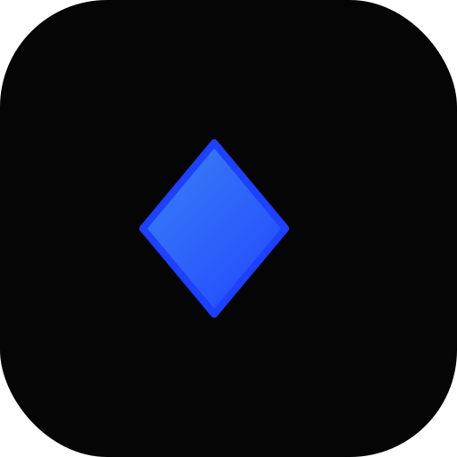

# 🧠 SmartBuilder / KnowSpark

> An elegant, AI-powered knowledge workspace for creators, coders, and thinkers.

<p align="center">
  
</p>

<p align="center">
  <strong>Build. Learn. Visualize.</strong><br/>
  Intelligent project-based Q&A workspace with AI, logic diagrams, and beautiful UX.
</p>

---

## ✨ Features at a Glance

<table align="center">
  <tr>
    <td align="center" width="33%">
      <br/>
      <b>AI-Powered Answers</b><br/>
      <small>Gemini 2.5 Flash integration for intelligent, structured answers.</small>
    </td>
    <td align="center" width="33%">
      <br/>
      <b>Logic Diagrams</b><br/>
      <small>Generate & visualize logic circuits interactively with React Flow.</small>
    </td>
    <td align="center" width="33%">
      <br/>
      <b>Project Sync</b><br/>
      <small>Local + Cloud sync (Supabase) with offline-first support.</small>
    </td>
  </tr>
</table>

---

## 🧩 Tech Stack

| Category | Tools Used |
|----------|-----------|
| **Framework** | Next.js 14 (App Router) |
| **Language** | TypeScript |
| **Styling** | Tailwind CSS + Framer Motion |
| **Database** | Supabase (auth + sync) |
| **AI Engine** | Google Gemini 2.5 Flash |
| **Rendering** | React Markdown, KaTeX, Highlight.js, React Flow |

---

## 🌗 UI/UX Design Highlights

<p align="center">
  <br/>
</p>

| Mode | Theme |
|------|-------|
| 🖤 **Dark Mode** | Deep black base `#050505` with glowing electric blue accents `#1E40FF` |
| ⚪ **Light Mode** | Calm neutral white with cool blue highlights `#2563EB` |
| ✨ **Style** | Minimal, glassy cards with motion and focus glow |
| 🪄 **Typography** | Inter / Outfit – elegant and clear |

---

## 🎥 Animations & Micro-Interactions

| Interaction | Description |
|-------------|-------------|
| **Card hover** | Soft scale-up with blue glow |
| **Regenerate answer** | Button pulses with gradient before showing result |
| **Theme switch** | Smooth 400ms fade transition |
| **Sidebar active** | Glowing blue highlight border |
| **Code block copy** | "Copied ✓" toast animation |

<p align="center">
  
</p>

---

## 💡 Core Capabilities

### 🧠 AI Features

- ✅ Dynamic topic detection (Programming / Boolean / Math / Theory)
- ✅ Auto language recognition (Java, Python, C++)
- ✅ Constraint-aware responses ("without if", "using recursion")
- ✅ Markdown + LaTeX + Syntax highlighting
- ✅ Diagram JSON auto-generation (React Flow nodes)

### 🧾 Project & Data

- ✅ Multi-project system (create, rename, delete)
- ✅ Offline storage (localStorage)
- ✅ Supabase sync (cloud backup + user isolation)
- ✅ Merge strategy: latest version wins

### 🔒 Auth & Sharing

- ✅ Email + Google login (Supabase)
- ✅ Public shareable read-only pages
- ✅ Secure user-based project access
- ✅ RLS-enforced data privacy

---

## 🖥️ Preview

```
SmartBuilder /
├── app/
│   ├── [projectId]/
│   ├── auth/
│   └── share/
├── components/
│   ├── project-sidebar.tsx
│   ├── project-header.tsx
│   ├── question-card.tsx
│   └── diagram-renderer.tsx
├── lib/
│   ├── ai.ts
│   ├── analyze.ts
│   └── supabase/
├── public/
│   └── assets/branding/logo.svg
└── tailwind.config.ts
```

---

## 🧭 Getting Started

### 1️⃣ Install dependencies

```bash
npm install
```

### 2️⃣ Add your environment variables

```bash
cp .env.local.example .env.local
```

Required environment variables:
- `NEXT_PUBLIC_SUPABASE_URL` - Your Supabase project URL
- `NEXT_PUBLIC_SUPABASE_ANON_KEY` - Your Supabase anon key
- `GOOGLE_GENERATIVE_AI_API_KEY` - Your Google Gemini API key

### 3️⃣ Run locally

```bash
npm run dev
```

### 4️⃣ Visit

Open [http://localhost:3000](http://localhost:3000) in your browser.

---

## ⚡ Deployment

Deployed easily via **Vercel**:

```bash
vercel --prod
```

Supports:
- ✅ Serverless API routes (`/api/ask`)
- ✅ Static optimization for share pages
- ✅ Environment-based API key injection

---

## 🧩 Preview UI Concept

<p align="center">
  
</p>

💡 Cards gently glow blue on hover, sidebar has blurred glass depth, and answers animate into place using Framer Motion.

---

## 💬 Future Roadmap

- [ ] **Focus Mode** (distraction-free single card view)
- [ ] **Command Palette** (Ctrl+K) for navigation
- [ ] **Multi-question recognition**
- [ ] **Code explain / refactor buttons**
- [ ] **Export to PDF or Markdown**

---

## 💖 Credits

Created with ☕, ⚛️, and ✨ by **Lucky / KnowSpark Team**

<p align="center">
  
  
</p>

---

## 🪄 "Knowledge. Simplified."

**KnowSpark** isn't just an AI Q&A tool —  
it's a workspace for understanding,  
built with clarity, trust, and design in mind.

---

<p align="center">
  <sub>Built with Next.js, TypeScript, and ❤️</sub>
</p>
